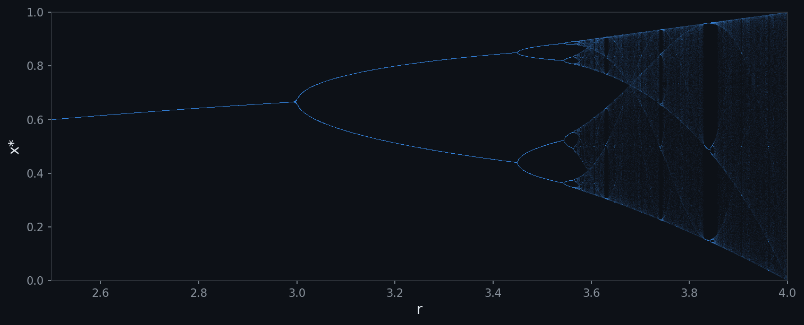

# dynachaos

[](https://github.com/ricardofrantz/dynachaos/actions/workflows/ci.yml)
[](https://www.python.org/)
[](LICENSE)

**High-performance chaos analysis in Python.**

Status: private research and development repository. Public release,
package publication, and final paper citation details are future work.

> *"Chaos: When the present determines the future, but the approximate present*
> *does not approximately determine the future."*
> — Edward Lorenz



## Why dynachaos?

Most chaos libraries stop at Lyapunov exponents. dynachaos collects maps,
coupled-map lattices, recurrence analysis, entropy diagnostics,
Grassberger-Procaccia correlation dimension, multifractal spectra, and
paper-generation pipelines in one codebase. Performance-sensitive kernels have
optional Rust backends, while pure-Python fallbacks keep the diagnostics usable
without a compiler.

## Features

**Maps** — logistic, circle, coupled logistic, delayed logistic, coupled
delayed, modulated circle, torus doubling (Map I / Map IV)

**Coupled Map Lattices** — CML with nearest-neighbor diffusive coupling,
globally coupled maps (GCM), pattern dynamics, cluster statistics

**Diagnostics** — Lyapunov exponents (1D + QR spectrum + flow systems),
0-1 test for chaos, SALI/GALI alignment indices, permutation entropy +
complexity-entropy planes, sample/approximate/fuzzy/multiscale entropy,
recurrence quantification analysis (RQA), Grassberger-Procaccia
correlation dimension, multifractal spectra ($D_q$, $f(\alpha)$),
AMI + Cao + FNN embedding

**Rust backends** — correlation integral (Grassberger-Procaccia), fuzzy
entropy sum, recurrence line extraction, ordinal distribution counting,
AMI histograms, Cao dimension selection, multifractal moments

**Visualization** — bifurcation diagrams, cobweb plots, return maps,
curated Swiss-inspired style themes

## Private Development Setup

```bash
git clone https://github.com/ricardofrantz/dynachaos.git
cd dynachaos
uv sync
uv run --extra viz pytest tests/ -q
```

To exercise the installed Rust extension locally:

```bash
uv run maturin develop --release
uv run --extra viz pytest tests/ -q
```

To verify the pure-Python fallback path:

```bash
DYNACHAOS_NO_RUST=1 uv run --extra viz pytest tests/ -q
```

## Quick Start

```python
import numpy as np
from dynachaos.maps import logistic, logistic_derivative
from dynachaos.diagnostics import lyapunov_exponent_1d, permutation_entropy

# Lyapunov exponent of the logistic map at the edge of chaos
f  = lambda x: logistic(x, 1.99)
df = lambda x: logistic_derivative(x, 1.99)
lam = lyapunov_exponent_1d(f, df, x0=0.1, n_iter=100_000)
print(f"lambda = {lam:.4f}")   # ~ 0.69

# Permutation entropy of a chaotic series
series = np.empty(10_000)
series[0] = 0.1
for i in range(1, len(series)):
    series[i] = logistic(series[i - 1], 1.99)
H = permutation_entropy(series, d=5)
print(f"H_PE = {H:.4f}")       # ~ 0.98 (near-random)
```

```python
from dynachaos.diagnostics import correlation_dimension, sample_entropy
from dynachaos.diagnostics.recurrence import embed_time_delay

# Correlation dimension of the logistic map attractor
traj = embed_time_delay(series, d=3, tau=1)
D2, r, C, slopes, mask = correlation_dimension(traj, theiler_window=1)
print(f"D2 = {D2:.3f}")        # ~ 0.96

# Sample entropy (regularity measure)
se = sample_entropy(series, m=2)
print(f"SampEn = {se:.4f}")
```

```bash
# Compare Grassberger-Procaccia vs multifractal D2
uv run --extra viz python examples/benchmark_gp_vs_multifractal.py
```

## Rust-Accelerated Backends

Performance-critical algorithms are implemented as Rust kernels and loaded
automatically when the extension is installed.
Pure-Python fallbacks are always available and produce identical results.

### Correlation integral (Grassberger-Procaccia)

The all-pairs kernel evaluates all N(N−1)/2 pairs with Theiler-window
exclusion and multi-radius binning in a single pass.
The implementation is designed for correctness and low memory use,
offering several advantages over common baseline scripts (e.g., [notsebastiano/GP_algorithm](https://github.com/notsebastiano/GP_algorithm/blob/master/GP_algorithm.py)):

- **Algorithmic Correctness** — Supports the **Theiler window** ($|i-j| > w$) to
  exclude temporally correlated pairs (Theiler 1986) and uses proper
  normalization ($C(r) \le 1$).
- **Scaling Region Detection** — Employs a **stable plateau search** on local
  slopes instead of simple heuristics, making it robust to noise and saturation.
- **Memory Efficiency** — Uses **O(1) auxiliary memory** per pair (streaming)
  instead of an $O(N^2)$ distance matrix.

The Rust kernel uses:

- **Raw slice indexing** — C-contiguous slice access, avoiding ndarray's
  per-index `Index` overhead while staying in safe Rust
- **Prefix-sum binning** — one write per pair instead of up to 50;
  converted to cumulative counts with a single O(n_r) pass after the loop
- **Squared-distance comparison** — pre-squared thresholds eliminate
  `sqrt()` in Euclidean mode (saves 10–20 cycles per pair)
- **Branch-separated loops** — Chebyshev and Euclidean paths are fully
  separated, enabling independent auto-vectorization
- **Rayon parallelism** — outer loop distributed across all cores via
  Rayon; GIL released with `py.detach()` before the parallel region
- **Native compiler optimization** — release builds can use the local CPU
  target configured under `.cargo/`.

Benchmark numbers should be regenerated on the release target hardware before
being used in public documentation.

### Fuzzy entropy sum

Computes Σ exp(−(d/r)ⁿ) over all upper-triangle pairs on mean-centered
templates, using the same Rayon parallel fold + reduce pattern.

## Algorithm Reference

| Algorithm | Module | Rust kernel | Reference |
|-----------|--------|-------------|-----------|
| Lyapunov exponent (1D) | `diagnostics.lyapunov` | — | Benettin et al. 1980 |
| Lyapunov spectrum (QR) | `diagnostics.lyapunov` | — | Benettin et al. 1980 |
| Flow Lyapunov spectrum | `diagnostics.lyapunov` | — | Benettin et al. 1980 |
| 0-1 test for chaos | `diagnostics.zero_one_test` | — | Gottwald & Melbourne 2004 |
| SALI / GALI | `diagnostics.sali_gali` | — | Skokos et al. 2007 |
| Permutation entropy | `diagnostics.permutation` | ordinal dist. | Bandt & Pompe 2002 |
| Complexity-entropy plane | `diagnostics.permutation` | ordinal dist. | Rosso et al. 2007 |
| Sample entropy | `diagnostics.entropy` | correlation counts | Richman & Moorman 2000 |
| Approximate entropy | `diagnostics.entropy` | — | Pincus 1991 |
| Fuzzy entropy | `diagnostics.entropy` | fuzzy sum | Chen et al. 2007 |
| Multiscale entropy | `diagnostics.entropy` | correlation counts | Costa et al. 2002 |
| RQA (DET, LAM, ENTR, …) | `diagnostics.recurrence` | line extraction | Marwan et al. 2007 |
| Correlation dimension | `diagnostics.correlation` | all-pairs kernel | Grassberger & Procaccia 1983 |
| Multifractal spectrum ($D_q$, $f(\alpha)$) | `diagnostics.multifractal` | multifractal moments | Mukherjee et al. 2024 |
| AMI (embedding) | `diagnostics.embedding` | histogram | Fraser & Swinney 1986 |
| Cao's method | `diagnostics.embedding` | dimension selector only | Cao 1997 |
| False nearest neighbors | `diagnostics.embedding` | — | Kennel et al. 1992 |

## Showcase: Kaneko Atlas

A companion manuscript and figure
pipeline currently driving dynachaos development. It revisits Kunihiko
Kaneko's foundational work on chaos with reproducible Python/Rust diagnostics.

```bash
dynachaos list                    # list paper sections
dynachaos run sec02_circle_map    # reproduce a figure
dynachaos run all                 # full pipeline
```

To rebuild the tracked manuscript PDF:

```bash
cd paper
pdflatex -interaction=nonstopmode -halt-on-error main.tex
bibtex main
pdflatex -interaction=nonstopmode -halt-on-error main.tex
pdflatex -interaction=nonstopmode -halt-on-error main.tex
```

## Development

```bash
uv sync
uv run --extra viz pytest tests/ -q
uv run --extra viz ruff check src/ tests/
uv run --extra viz ruff format src/ tests/ --check

# With Rust extension:
uv run maturin develop --release
uv run --extra viz pytest tests/ -q
```

## Citation

Citation metadata is provisional while the repository and manuscript remain
private. Do not treat the companion paper entry as a published article until
the public release phase is explicitly completed.

```bibtex
@software{dynachaos2026,
  author  = {Frantz, Ricardo},
  title   = {dynachaos: High-performance chaos analysis in Python},
  year    = {2026},
  version = {0.2.0},
  url     = {https://github.com/ricardofrantz/dynachaos},
  license = {MIT}
}

@article{removed,
  author  = {Frantz, Ricardo},
  
             },
  
  year    = {2026}
}
```

## License

MIT
